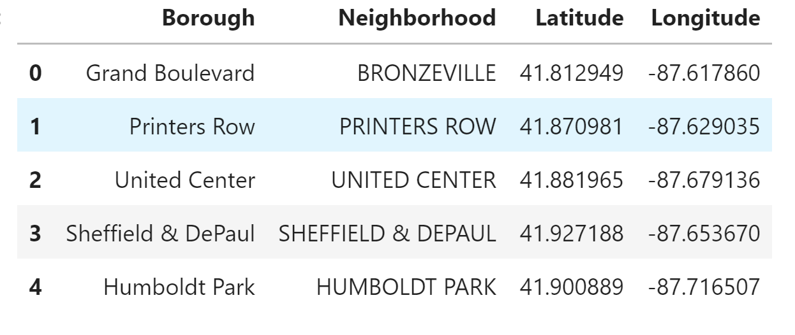
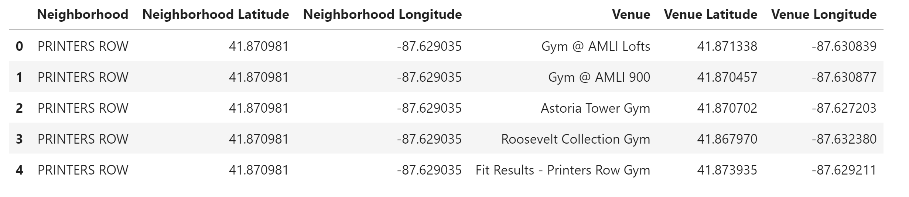
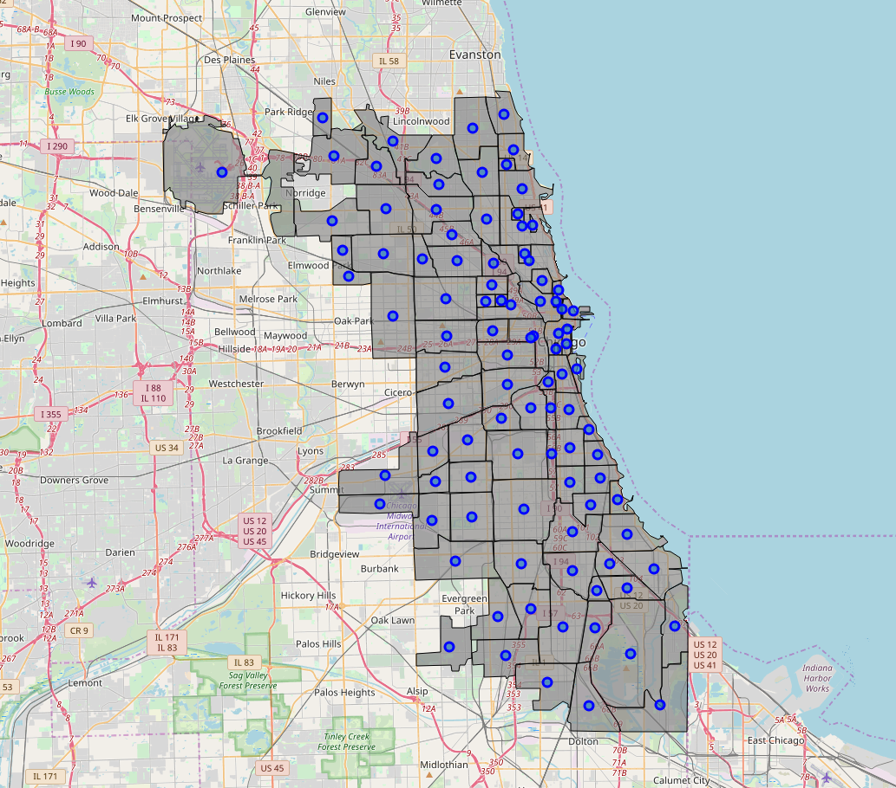
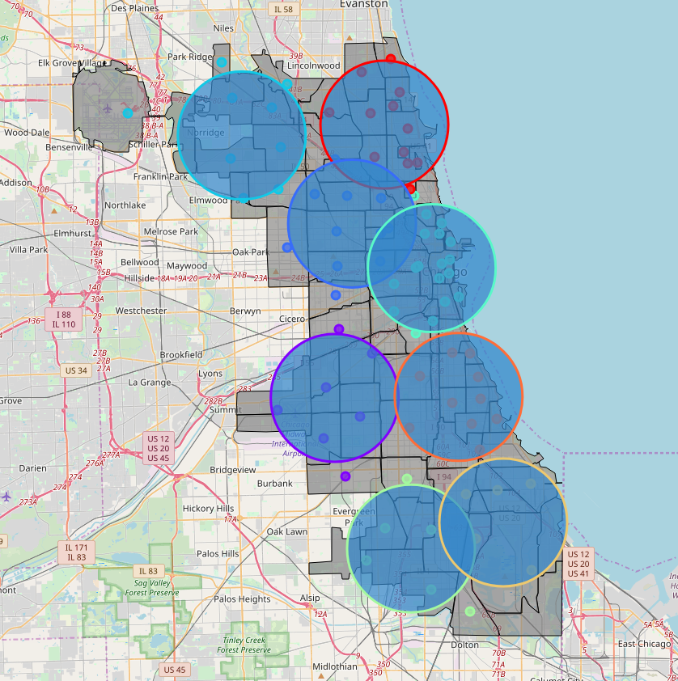
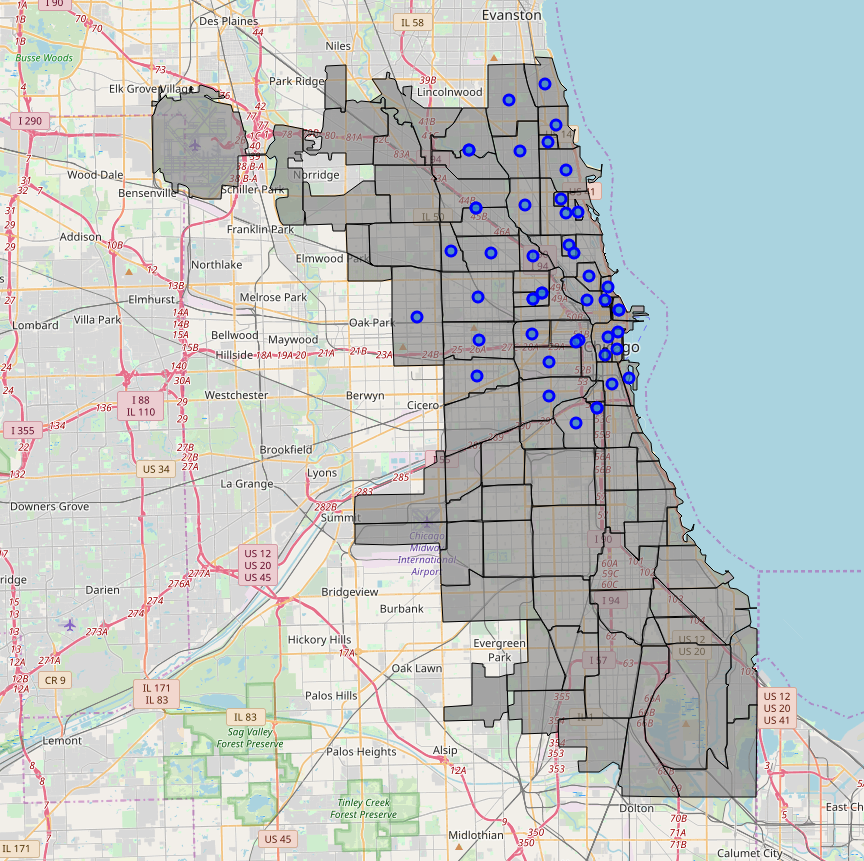
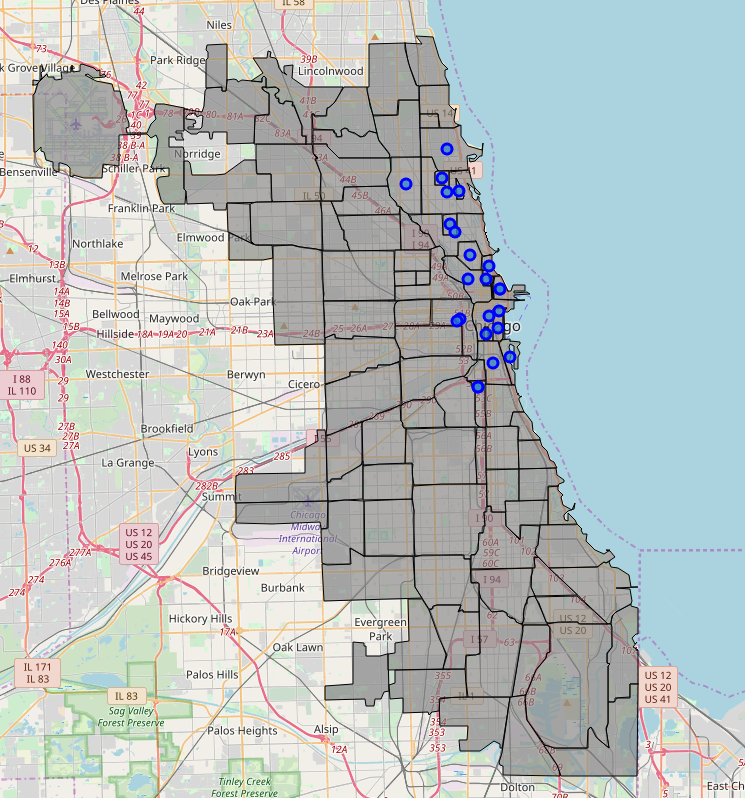

# Coursera_Capstone
Coursera Capstone Repository

# 1. Introduction
## 1.1 Background
Now a days it is becoming more frecuent to see people who cares about their health. A consecuence of this is the fact that places related with healthcare, like gyms, have much more attendance than past years. 

On the other hand Chicago is a very big city, plenty of people which spend mos of their time at work and do not have much time left for activities such as coking. Even though there are plenty of good restaurants in any city, most of this places are fast food or, at least, no so healthy food. So, if you want to open a new food bussines, a healthy restaurant sounds like a good idea of bussiness.

Opening a restaurant is a challenging project, so that in order to open such kind of restaurant in a big city like Chicago, one have to care about which is the best location to place it. Data science arises as the needed tool to answer this question. 

## 1.2 Problem
The first step will be to acquire useful data. The density of gyms in different parts of the city can be very valuable info, as the target of the restaurant is people who are likely to go to the this places. To use as location a region of the city where there is a high density of gyms can ensure a good visibility for the commerce.

Chicago is divided in a lot of small neighborhoods. To use one of those areas to choose a location can be too much restictive due to the size. Use instead a cluster of neighborhoods can be a much better option, because if offers a bigger area to search for a place to locate the restaurant.

# 2. Data description
## 2.1 Data sources
The first place to look for data of the city is the [Chicago Data Portal](https://data.cityofchicago.org), where there is plenty of data to work with. Inside this page one can find geospatial data of all the neighborhoods in the city, [link](https://data.cityofchicago.org/api/geospatial/bbvz-uum9?method=export&format=GeoJSON).

The [Foursquare](https://foursquare.com/developers/apps) API provides us of a source of information about any kind of venues in a lot of places around the world. A request to this service will give the location of the gyms around a given coordinates.

## 2.2 Data cleaning
The data of the neighborhoods downloaded from the Chicago portal is in a json file. Inside this file there are several properties of each neighborhood. I stracted the "primary neighborhood" wich is the borough, the " secondary neighborhood", the proper name of the neighborhood, and the geographical info. This geographical data is in the format of points which delimitates the area of the neighborhood. I used a function to put into a pandas dataframe the borough, neighborhood, latitude and longitude of each element of the list in the json file. For the geographical info I used a function which calculates the centroid of any polygon to get the coordinates of the neighborhood. An example of the table I get is in Fig. 1.
 *Fig. 1: table of neighborhoods.*

To get the locations of the gyms close to a given coordinates I used the Foursquare API. We can obtain a json file as the result of doing a request to Foursquare, which contains a list of all the venues that we asked for. Form this file we can extract for each venue it's name, latitude and longitude. I modified a function from the previous notebooks on the course, to get a function which can do a request and extract the required info and put it into a pandas data frame. An example of the data frame obtainded with a request and merged with the neighborhoods is Fig. 2.
 *Fig. 2: table of gyms merged with neighborhoods data frame.*

Once I get the pandas data frames, using those tools, I am able to handle the data and merge it to get the final tables I need to get the results.

# 3. Methodology

As it is described in Sec. 2, we have a data frame with the neighborhoods and their geographical info. In Fig. 3 there is a map of Chicago where the neighborhoods are shown in both ways, with the downloaded delimiters and the calculated centroids for each one.
 *Fig. 3: Chicago map.*

Now we want to know where is the major density of gyms in the city. We use Foursquare API as described in Sec. 2 to get this info. First one have to define a radius around the coordinates from which one want to do the request. The first idea I had to get the proper place for the new restaurant, was to do a request for the gyms in about 500 m around the center of each neighborhood in the city. Then group neighborhoods in clusters and recommend one of them as the best area to place the restaurant. The problem with that is that there can be some overlapping between the areas in the different neighborhoods, in that way that some gyms can be counted twice in the part of the city where the neighborhoods are close to each other. Also there can be some areas which are not taken into account in the places of the city where the neighborhoods are separated.

Instead I thought that is a better idea to first cluster the neighborhoods to get the a low number of differentiated areas in the city. Then choose a radius around the center of each cluster to do the request. In that way we can cover almost all the area in the city with the requests. Also in this way does not matter that some areas have some overlapping, because we threat each one separately and there is not double counting of gyms. Finally we can get the area with the higher density of gyms and recommend it to find a place to open the business.

I choose to divide the city in 8 clusters and assign a radius of 4.5 Km around the center of each one. With this election of parameters the clusters are well differentiated and almost all the area in the city is covered. Fig. 4 shows a map of the Chicago where I marked all the neighborhoods, with colours which indicate the cluster where thy belong, and the centers of the clusters with circles show the area considered for each.
 *Fig. 4: the colour of each neighborhood indicates the different cluster assignment. The blue circles cover an area of 4.5 Km around the center of each cluster.*

The next problem to face is that the maximum number of venues which can be returned in one request is 50. As there are several clusters that reach that number, we have to divide the city in smaller areas. Before do that, we can use the information we obtained to this point to discard the areas of the less dense clusters. Now I dropped the neighborhoods of those neighborhoods with small number of gyms and repeat the previous steps with the reduced list.
 *Fig. 5: Map with markers only in the remaining neighborhoods after drop those of the clusters with less density of gyms.*

# 4. Results and discussion

I applied the procedure described in Sec. 3 to the original downloaded data frame of the Chicago neighborhoods. After that I did the same procedure to the new data frame, which only contains the neighborhoods of the clusters labelled as 0, 2 and 4. This means that I made 8 new clusters for the remaining neighborhoods and requested the number of gyms in those clusters. Again I had as a result that 3 clusters have 50 gyms and the others had less. I dropped again the neighborhoods of the less dense clusters. The final data frame had only 22 from the original 98 neighborhoods, Fig. 6.
 *Fig. 6: Map with markers only in the remaining neighborhoods after the second dropping of those of the clusters with less density of gyms.*

Finally I repeated the process a third time. Using five clusters for the last request. Fig. 7 shows the remaining areas after dropping the less dense cluster of neighborhoods.

The final results shows the area of the city with the higher density of gyms. Based on this data, in the map we can see that the north part of the city is more appropriated to open a healthy food restaurant. 

# 5. Conclusion

The objective of this work is to search for the best place in the city of Chicago to open a restaurant of healthy food. We work under the premise that the most interesting target to this kind of business is the people who cares for their health. This kind of people used to go frequently to sport places like gyms. This fact motivates us to search for the areas in the city where the density of gyms is high.

I used machine learning methods to cluster the neighborhoods of the city in order to search in those areas for the number of gyms. The original idea was to do keep just one or two clusters but, due to the limitations in the Foursquare requests, I had to keep more clusters and iteratively reduce the searching areas.

Finally I reduce the better locations to search for a place to open the restaurant, to a group of neighborhoods in the north of the city.

